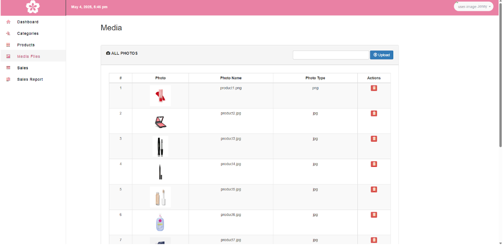

# 📦 Francheska's Sales and Inventory Management System

A web-based **Sales and Inventory Management System** built using the **Laravel PHP Framework** and **MySQL**.  
This system helps streamline product tracking, sales recording and stock monitoring.

---

## 📌 Features

✅ **Dashboard Overview**  
- View key metrics: total products, sales, low stock alerts, and expired items

✅ **Inventory Management**  
- Add, update, and delete products  
- Monitor stock levels with low stock and out-of-stock indicators  
- Track product expiration dates and delivery dates

✅ **Sales Management**  
- Create and manage sales records  
- Auto-calculate totals  
- Generate basic sales reports

✅ **User Access**  
- Admin login for secure access  

✅ **Categories and Media Files**  
- Organize products by category  
- Upload and manage product images

---

## 🛠️ Technologies Used

| Stack        | Details                         |
|--------------|----------------------------------|
| **Framework**| Laravel (PHP)                    |
| **Language** | PHP, HTML, Blade Templating      |
| **Database** | MySQL                            |
| **Frontend** | Bootstrap, Blade, CSS            |
| **Tools**    | Laravel Artisan,    |

---
Login 
  

Dashboard
  

Categories
  

Products
  

Add Product
  

Low Stock Items
  

Expired Products
  

Media Files
  

Sales
  

Sales Report
  

Sales Report Summary
 

Monthly Sales
  

Daily Sales
  

